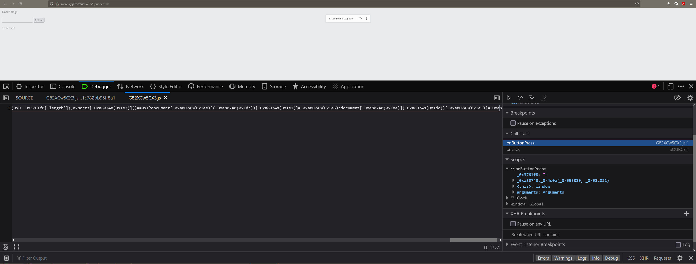

# Some Assembly Required
- Category: Web
- Points: 70
- Flag: picoCTF{cb688c00b5a2ede7eaedcae883735759}

## Challenge
http://mercury.picoctf.net:40226/index.html

## First Steps
I pulled the source code of the webpage into a file
```wget http://mercury.picoctf.net:40226/index.html```
which gave me
```
StatusCode        : 200
StatusDescription : OK
Content           : <html>
                    <head>
                    	<meta charset="UTF-8">
                    	<script src="G82XCw5CX3.js"></script>
                    </head>
                    <body>
                    	<h4>Enter flag:</h4>
                    	<input type="text" id="input"/>
                    	<button 
                    onclick="onButtonPress()">Submit</button>
                    	<...
RawContent        : HTTP/1.1 200 OK
                    Content-Length: 235
                    Content-Type: text/html
                    Last-Modified: Tue, 16 Mar 2021 00:38:36 GMT
                    
                    <html>
                    <head>
                    	<meta charset="UTF-8">
                    	<script src="G82XCw5CX3.js"></script>
                    </head>
                    <bod...
Forms             : {}
Headers           : {[Content-Length, 235], [Content-Type, 
                    text/html], [Last-Modified, Tue, 16 Mar 2021 
                    00:38:36 GMT]}
Images            : {}
InputFields       : {@{innerHTML=; innerText=; outerHTML=<INPUT 
                    id=input>; outerText=; tagName=INPUT; 
                    id=input}}
Links             : {}
ParsedHtml        : mshtml.HTMLDocumentClass
RawContentLength  : 235
```
I didn't see anything interesting...
I moved onto checking G82XCw5CX3.js
```
const _0x402c=['value','2wfTpTR','instantiate','275341bEPcme','innerHTML','1195047NznhZg','1qfevql','input','1699808QuoWhA','Correct!','check_flag','Incorrect!','./JIFxzHyW8W','23SMpAuA','802698XOMSrr','charCodeAt','474547vVoGDO','getElementById','instance','copy_char','43591XxcWUl','504454llVtzW','arrayBuffer','2NIQmVj','result'];const _0x4e0e=function(_0x553839,_0x53c021){_0x553839=_0x553839-0x1d6;let _0x402c6f=_0x402c[_0x553839];return _0x402c6f;};(function(_0x76dd13,_0x3dfcae){const _0x371ac6=_0x4e0e;while(!![]){try{const _0x478583=-parseInt(_0x371ac6(0x1eb))+parseInt(_0x371ac6(0x1ed))+-parseInt(_0x371ac6(0x1db))*-parseInt(_0x371ac6(0x1d9))+-parseInt(_0x371ac6(0x1e2))*-parseInt(_0x371ac6(0x1e3))+-parseInt(_0x371ac6(0x1de))*parseInt(_0x371ac6(0x1e0))+parseInt(_0x371ac6(0x1d8))*parseInt(_0x371ac6(0x1ea))+-parseInt(_0x371ac6(0x1e5));if(_0x478583===_0x3dfcae)break;else _0x76dd13['push'](_0x76dd13['shift']());}catch(_0x41d31a){_0x76dd13['push'](_0x76dd13['shift']());}}}(_0x402c,0x994c3));let exports;(async()=>{const _0x48c3be=_0x4e0e;let _0x5f0229=await fetch(_0x48c3be(0x1e9)),_0x1d99e9=await WebAssembly[_0x48c3be(0x1df)](await _0x5f0229[_0x48c3be(0x1da)]()),_0x1f8628=_0x1d99e9[_0x48c3be(0x1d6)];exports=_0x1f8628['exports'];})();function onButtonPress(){const _0xa80748=_0x4e0e;let _0x3761f8=document['getElementById'](_0xa80748(0x1e4))[_0xa80748(0x1dd)];for(let _0x16c626=0x0;_0x16c626<_0x3761f8['length'];_0x16c626++){exports[_0xa80748(0x1d7)](_0x3761f8[_0xa80748(0x1ec)](_0x16c626),_0x16c626);}exports['copy_char'](0x0,_0x3761f8['length']),exports[_0xa80748(0x1e7)]()==0x1?document[_0xa80748(0x1ee)](_0xa80748(0x1dc))[_0xa80748(0x1e1)]=_0xa80748(0x1e6):document[_0xa80748(0x1ee)](_0xa80748(0x1dc))[_0xa80748(0x1e1)]=_0xa80748(0x1e8);}
```
I used https://deobfuscate.io/ to deobfuscate the script.
```
const raquela = ["value", "2wfTpTR", "instantiate", "275341bEPcme", "innerHTML", "1195047NznhZg", "1qfevql", "input", "1699808QuoWhA", "Correct!", "check_flag", "Incorrect!", "./JIFxzHyW8W", "23SMpAuA", "802698XOMSrr", "charCodeAt", "474547vVoGDO", "getElementById", "instance", "copy_char", "43591XxcWUl", "504454llVtzW", "arrayBuffer", "2NIQmVj", "result"];
const trilby = function (jarret, semere) {
  jarret = jarret - 470;
  let dejanai = raquela[jarret];
  return dejanai;
};
(function (gerold, daedalus) {
  const kenderrick = trilby;
  while (!![]) {
    try {
      const eino = -parseInt(kenderrick(491)) + parseInt(kenderrick(493)) + -parseInt(kenderrick(475)) * -parseInt(kenderrick(473)) + -parseInt(kenderrick(482)) * -parseInt(kenderrick(483)) + -parseInt(kenderrick(478)) * parseInt(kenderrick(480)) + parseInt(kenderrick(472)) * parseInt(kenderrick(490)) + -parseInt(kenderrick(485));
      if (eino === daedalus) break; else gerold.push(gerold.shift());
    } catch (marquet) {
      gerold.push(gerold.shift());
    }
  }
}(raquela, 627907));
let exports;
(async () => {
  const lashawanda = trilby;
  let aleksy = await fetch(lashawanda(489)), aramie = await WebAssembly[lashawanda(479)](await aleksy[lashawanda(474)]()), jasir = aramie[lashawanda(470)];
  exports = jasir.exports;
})();
function onButtonPress() {
  const videlle = trilby;
  let lanyia = document.getElementById(videlle(484))[videlle(477)];
  for (let ivalee = 0; ivalee < lanyia.length; ivalee++) {
    exports[videlle(471)](lanyia[videlle(492)](ivalee), ivalee);
  }
  exports.copy_char(0, lanyia.length), exports[videlle(487)]() == 1 ? document[videlle(494)](videlle(476))[videlle(481)] = videlle(486) : document[videlle(494)](videlle(476))[videlle(481)] = videlle(488);
}
```
still not really able to make anything out but I see a clear compare - if (eino == daedalus) break; - so I wanted to see if I could step through the code in the browser using the firefox web tools debugger in order to find what is stored in these variables. 
 While stepping through, right around when there is a while loop forming the string for a variable, it took me to file I hadn't seen before. 
```
(module
  (table $table0 1 1 funcref)
  (memory $memory0 2)
  (global $global0 (mut i32) (i32.const 66864))
  (global $global1 i32 (i32.const 1072))
  (global $global2 i32 (i32.const 1024))
  (global $global3 i32 (i32.const 1328))
  (global $global4 i32 (i32.const 1024))
  (global $global5 i32 (i32.const 66864))
  (global $global6 i32 (i32.const 0))
  (global $global7 i32 (i32.const 1))
  (export "memory" (memory $memory0))
  (export "__wasm_call_ctors" (func $func0))
  (export "strcmp" (func $func1))
  (export "check_flag" (func $func2))
  (export "input" (global $global1))
  (export "copy_char" (func $func3))
  (export "__dso_handle" (global $global2))
  (export "__data_end" (global $global3))
  (export "__global_base" (global $global4))
  (export "__heap_base" (global $global5))
  (export "__memory_base" (global $global6))
  (export "__table_base" (global $global7))
  (func $func0
  )
  (func $func1 (param $var0 i32) (param $var1 i32) (result i32)
    (local $var2 i32) (local $var3 i32) (local $var4 i32) (local $var5 i32) (local $var6 i32) (local $var7 i32) (local $var8 i32) (local $var9 i32) (local $var10 i32) (local $var11 i32) (local $var12 i32) (local $var13 i32) (local $var14 i32) (local $var15 i32) (local $var16 i32) (local $var17 i32) (local $var18 i32) (local $var19 i32) (local $var20 i32) (local $var21 i32) (local $var22 i32) (local $var23 i32) (local $var24 i32) (local $var25 i32) (local $var26 i32) (local $var27 i32) (local $var28 i32) (local $var29 i32) (local $var30 i32) (local $var31 i32) (local $var32 i32) (local $var33 i32) (local $var34 i32) (local $var35 i32) (local $var36 i32) (local $var37 i32) (local $var38 i32) (local $var39 i32) (local $var40 i32) (local $var41 i32) (local $var42 i32) (local $var43 i32)
    global.get $global0
    local.set $var2
    i32.const 32
    local.set $var3
    local.get $var2
    local.get $var3
    i32.sub
    local.set $var4
    local.get $var4
    local.get $var0
    i32.store offset=24
    local.get $var4
    local.get $var1
    i32.store offset=20
    local.get $var4
    i32.load offset=24
    local.set $var5
    local.get $var4
    local.get $var5
    i32.store offset=16
    local.get $var4
    i32.load offset=20
    local.set $var6
    local.get $var4
    local.get $var6
    i32.store offset=12
    block $label1
      loop $label2
        local.get $var4
        i32.load offset=16
        local.set $var7
        i32.const 1
        local.set $var8
        local.get $var7
        local.get $var8
        i32.add
        local.set $var9
        local.get $var4
        local.get $var9
        i32.store offset=16
        local.get $var7
        i32.load8_u
        local.set $var10
        local.get $var4
        local.get $var10
        i32.store8 offset=11
        local.get $var4
        i32.load offset=12
        local.set $var11
        i32.const 1
        local.set $var12
        local.get $var11
        local.get $var12
        i32.add
        local.set $var13
        local.get $var4
        local.get $var13
        i32.store offset=12
        local.get $var11
        i32.load8_u
        local.set $var14
        local.get $var4
        local.get $var14
        i32.store8 offset=10
        local.get $var4
        i32.load8_u offset=11
        local.set $var15
        i32.const 255
        local.set $var16
        local.get $var15
        local.get $var16
        i32.and
        local.set $var17
        block $label0
          local.get $var17
          br_if $label0
          local.get $var4
          i32.load8_u offset=11
          local.set $var18
          i32.const 255
          local.set $var19
          local.get $var18
          local.get $var19
          i32.and
          local.set $var20
          local.get $var4
          i32.load8_u offset=10
          local.set $var21
          i32.const 255
          local.set $var22
          local.get $var21
          local.get $var22
          i32.and
          local.set $var23
          local.get $var20
          local.get $var23
          i32.sub
          local.set $var24
          local.get $var4
          local.get $var24
          i32.store offset=28
          br $label1
        end $label0
        local.get $var4
        i32.load8_u offset=11
        local.set $var25
        i32.const 255
        local.set $var26
        local.get $var25
        local.get $var26
        i32.and
        local.set $var27
        local.get $var4
        i32.load8_u offset=10
        local.set $var28
        i32.const 255
        local.set $var29
        local.get $var28
        local.get $var29
        i32.and
        local.set $var30
        local.get $var27
        local.set $var31
        local.get $var30
        local.set $var32
        local.get $var31
        local.get $var32
        i32.eq
        local.set $var33
        i32.const 1
        local.set $var34
        local.get $var33
        local.get $var34
        i32.and
        local.set $var35
        local.get $var35
        br_if $label2
      end $label2
      local.get $var4
      i32.load8_u offset=11
      local.set $var36
      i32.const 255
      local.set $var37
      local.get $var36
      local.get $var37
      i32.and
      local.set $var38
      local.get $var4
      i32.load8_u offset=10
      local.set $var39
      i32.const 255
      local.set $var40
      local.get $var39
      local.get $var40
      i32.and
      local.set $var41
      local.get $var38
      local.get $var41
      i32.sub
      local.set $var42
      local.get $var4
      local.get $var42
      i32.store offset=28
    end $label1
    local.get $var4
    i32.load offset=28
    local.set $var43
    local.get $var43
    return
  )
  (func $func2 (result i32)
    (local $var0 i32) (local $var1 i32) (local $var2 i32) (local $var3 i32) (local $var4 i32) (local $var5 i32) (local $var6 i32) (local $var7 i32) (local $var8 i32) (local $var9 i32) (local $var10 i32)
    i32.const 0
    local.set $var0
    i32.const 1072
    local.set $var1
    i32.const 1024
    local.set $var2
    local.get $var2
    local.get $var1
    call $func1
    local.set $var3
    local.get $var3
    local.set $var4
    local.get $var0
    local.set $var5
    local.get $var4
    local.get $var5
    i32.ne
    local.set $var6
    i32.const -1
    local.set $var7
    local.get $var6
    local.get $var7
    i32.xor
    local.set $var8
    i32.const 1
    local.set $var9
    local.get $var8
    local.get $var9
    i32.and
    local.set $var10
    local.get $var10
    return
  )
  (func $func3 (param $var0 i32) (param $var1 i32)
    (local $var2 i32) (local $var3 i32) (local $var4 i32) (local $var5 i32) (local $var6 i32)
    global.get $global0
    local.set $var2
    i32.const 16
    local.set $var3
    local.get $var2
    local.get $var3
    i32.sub
    local.set $var4
    local.get $var4
    local.get $var0
    i32.store offset=12
    local.get $var4
    local.get $var1
    i32.store offset=8
    local.get $var4
    i32.load offset=12
    local.set $var5
    local.get $var4
    i32.load offset=8
    local.set $var6
    local.get $var6
    local.get $var5
    i32.store8 offset=1072
    return
  )
  (data (i32.const 1024) "picoCTF{cb688c00b5a2ede7eaedcae883735759}\00\00")
)
```
I control-F'ed it for picoCTF and found the flag.

## Right Path
Although I didn't come at this challenge from the correct angle, I learned what I should have done after further inspection. As the title suggests, this is a web assembly challenge. 

## Solve
open debug, step through until code is compiled to web assembly and exported, control f the web assembly for the flag


## Thoughts
### what is web assembly
code that can be ran in web browsers and is a compilation target for source languages like C, C++, Rust, etc. (A compiler takes the source files and turns them into web assembly. Ref below). In the js script, there is a wasmcall, which I'm sure means web asm and result in a file being compiled to web assembly. I think this happens when export is called, but I'm not sure how to replicate this in a harder challenge outside of just stepping through until export or some assembly call is made. 


https://developer.mozilla.org/en-US/docs/WebAssembly/Concepts


"Compilers are, in essence, translators that take input in one language and produce output in another. For example, Eiffel Software's compiler takes Eiffel-language input and produces C. GCC for Intel reads C-language input and produces x86 assembly. The GAS assembler for Intel takes x86 assembly and produces x86 object code. All three of these things are technically compilers.

Regardless of format, the input read by a compiler is called the source and the output is called the target. The latter term is taken from one of its definitions, "intended result."

The majority of compilers are designed to produce assembly or object code for a particular processor or architecture. Because of that, target is often used to refer to the architecture itself rather than the output format.

The target of a compiler does not need to be the same as the architecture where it runs, and in instances where that happens, the program is called a cross-compiler. (For example, GCC can be built to run on x86 systems to compile C into ARM assembly.)

Additionally, there are single compilers capable of producing output for different targets depending on input such as switches on the command line. These are called multi-target compilers" - Blrfl, StackExchange
