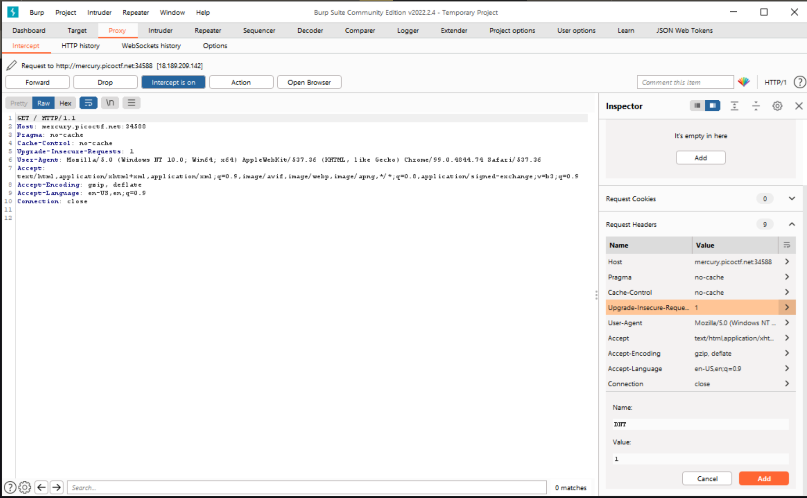

# Who Are You
- Category: Web
- Flag: picoCTF
- Points: 100

## Challenge
### Description
Let me in. Let me iiiiiiinnnnnnnnnnnnnnnnnnnn http://mercury.picoctf.net:34588/
### Hint
It ain't much, but it's an RFC https://tools.ietf.org/html/rfc2616

## First Steps
look at the hint. Find out that it's extremely dense.
## Right Path
The website says you must be using PicoBrowser (very similar to https://github.com/micahweiss25/Write-ups/tree/main/pico21/picobrowser). This time
I found out you can change what User-Agent firefox shows by going to about:config and creating "general.useragent.override" and assigning it
PicoBrowser. That takes you to the next page which says it doesn't trust someone from another website. This alludes to the referer header.
After looking extensively, I couldn't figure out how to change referer in the browser without an extension, so I moved to burp suite. 
In burp suite, I used proxy, intercept, and changed the request headers there. 
Set DNT to 1, Date to 2018, referer to the same website and then it says you have to be from sweden... I gave up and read someone elses write up
https://ctftime.org/writeup/26905

Referer: http://mercury.picoctf.net:34588/
Date: Wed, 21 Oct 2015 07:28:00 GMT
User-Agent: PicoBrowser
DNT: 1
X-Country-Code: 31.3.152.55
Accepted-Language: sv,en;q=0.9
