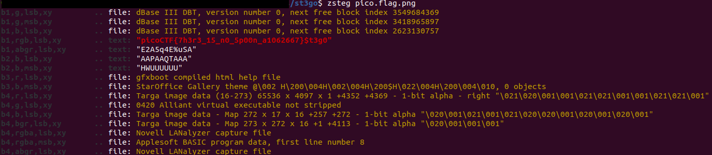

First, get the file <br />

then, we use a stego tool because I'm stupid and don't know any other way to do it
```
$ zsteg pico.flag.png
```
which return <br />

and there we go! There's the flag
picoCTF{7h3r3_15_n0_5p00n_a1062667}


